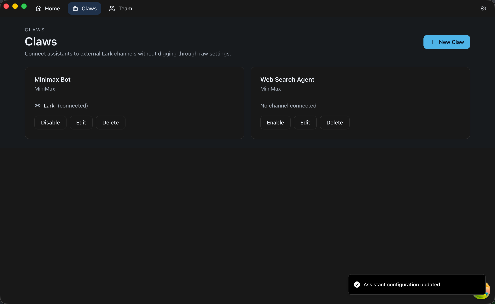
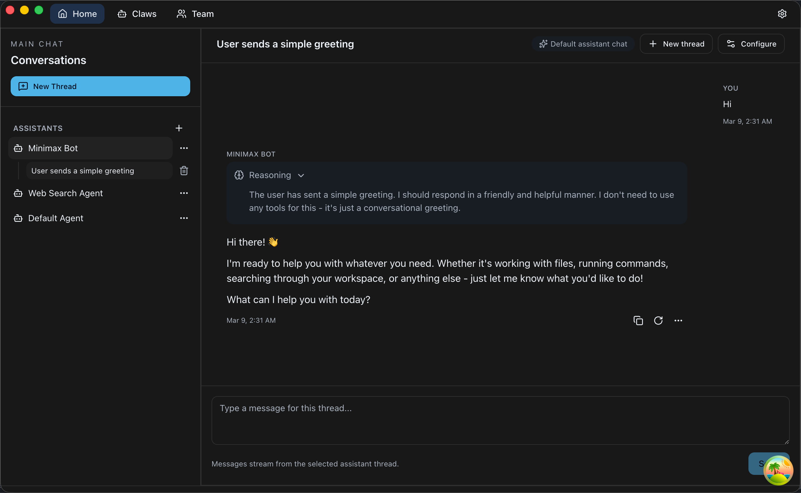

# TIA Studio

[中文说明](./README_zh.md)

<p align="center">
  
</p>

<div align="center">

[![][github-release-shield]][github-release-link]
[![][github-contributors-shield]][github-contributors-link]

</div>

An easy way to run a local claw on your own machine — and a full-featured desktop app for building, chatting with, and operating AI assistants, teams, and channels.

## What is TIA Studio?

TIA (short for "This Is AI") Studio is an Electron-based desktop app built to make local claws easy to run. Connect an assistant to a real-world channel and it becomes an OpenClaw-inspired local operator running close to your tools, your files, and your workflow.

At the same time, TIA Studio is a full-featured assistant app. You can chat with a single assistant, coordinate a team of assistants, organize threaded work, and manage channels from one local-first desktop workspace.

Today, TIA Studio supports Lark channels. Telegram and WhatsApp support are coming very soon, with more channels planned next.

## Full Assistant Workspace

When you want more than channel-connected automation, TIA Studio also gives you the full desktop workspace for assistants, teams, threads, and operations.

<p align="center">
  
</p>

## Architecture

TIA Studio is built on a carefully selected stack that prioritizes developer experience and maintainability:

- **[Mastra](https://mastra.ai)** - Powers the assistant, team, and channel runtime, providing a clean abstraction for connecting AI models and managing agent lifecycles
- **[Assistant UI](https://www.assistant-ui.com/)** - Delivers the chat interface components, handling message rendering, streaming responses, and conversation state
- **Electron + React** - Provides the desktop application shell with a modern React-based UI
- **TypeScript** - Ensures type safety across the entire codebase

### Design Philosophy

We intentionally kept the architecture simple:

1. **Assistants as first-class citizens** - Each assistant (like TIA or Default Agent) is a Mastra agent with its own configuration, capabilities, and channel presence
2. **Teams and channels by design** - Teams help coordinate multiple assistants, while channels let an assistant operate where real conversations already happen
3. **Workspace-centric** - Conversations are organized into threads and team views, making it easy to context-switch between different tasks
4. **Minimal abstractions** - We use Mastra's primitives directly rather than building custom layers, and Assistant UI handles the chat UX without custom message components
5. **Local-first** - Everything runs on your machine, with no required cloud dependencies

## Claws

In TIA Studio, a claw is not a separate runtime primitive. A claw is an assistant with a channel attached to it.

For a longer architecture walkthrough, see [CLAW.md](./CLAW.md).

This keeps the model simple:

- The assistant remains the source of truth for provider selection, instructions, memory, workspace, and lifecycle state
- The channel is only the transport layer that brings external messages in and sends assistant replies back out
- The claw UI is a focused management surface for creating that assistant + channel pairing without introducing a second identity model

### How claws are implemented

Claws are implemented by composing existing assistant and channel records instead of introducing a new database entity:

1. **Assistant-first creation** - `POST /v1/claws` creates a normal assistant, then either creates a new Lark channel or attaches an existing unbound channel to that assistant.
2. **Channel binding as the link** - The claw relationship lives on `channel.assistantId`, which gives each channel a single active assistant owner while keeping detached channels reusable.
3. **Built-in assistants stay out of the claw list** - The claws route only exposes user-managed assistants, so built-in agents keep their own lifecycle and do not show up as claws.
4. **Runtime reload on every claw change** - After create, update, or delete, TIA Studio reloads both the channel service and the cron scheduler so routing and schedules immediately reflect the new attachment state.
5. **One channel conversation becomes one assistant thread** - Incoming channel messages are routed through the event bus, mapped to a thread binding by remote chat, streamed through the assistant runtime, and then published back to the channel adapter as the outgoing reply.

### Claws, cron, heartbeat, and identity

Because a claw is still just an assistant underneath, assistant-owned behavior stays assistant-owned:

| Concern              | Owner                       | What happens for a claw                                                                                                                                                                 |
| -------------------- | --------------------------- | --------------------------------------------------------------------------------------------------------------------------------------------------------------------------------------- |
| Identity             | Assistant workspace         | `IDENTITY.md`, `SOUL.md`, and `MEMORY.md` are loaded as durable operating context for the same assistant whether you talk to it in the app or through a channel.                        |
| Heartbeat            | Assistant runtime           | Scheduled runs mark the request as a heartbeat run, which adds `HEARTBEAT.md` on top of the normal identity files only for proactive/scheduled execution.                               |
| Cron                 | Assistant + hidden thread   | Cron jobs are stored against `assistantId`, require that assistant to have a workspace root, and create a hidden thread so scheduled work stays attached to the same assistant history. |
| Enable/disable state | Assistant + channel runtime | A disabled claw disables the assistant side of the pairing, so runtime channel delivery and cron scheduling both stop until the assistant is enabled again.                             |

That means adapting an assistant into a claw does **not** fork its identity:

- Channel chat uses the same assistant instructions, provider, tools, and workspace as direct chat
- Cron jobs still belong to the assistant, not to the channel, and their outputs are written back to the assistant workspace work logs
- Heartbeat-specific guidance stays isolated in `HEARTBEAT.md`, so proactive runs can behave differently without mutating the assistant's core identity
- Future claw capabilities can keep building on assistant primitives instead of introducing a parallel claw-only configuration stack

## Features

- 🦾 Easy-to-run local claws when an assistant is paired with a channel
- 🤖 Full-featured AI assistant workspace with multiple assistants
- 👥 Teams for coordinating assistants in one workspace
- 📡 Channels that connect assistants to real conversations
- ✅ Lark support available today
- 🚧 Telegram and WhatsApp support coming very soon, with more channels next
- 💬 Thread-based conversation management
- 🎨 Clean, dark-themed interface
- 🔒 Local-first architecture
- ⚡ Fast, native desktop performance

## Getting Started

### Prerequisites

- Node.js 20+
- pnpm

### Installation

```bash
pnpm install

pnpm approve-builds # Make sure you approve every package that needs native builds
```

### Development

```bash
pnpm run dev
```

### Building

```bash
# For macOS
pnpm run build:mac

# For Windows
pnpm run build:win

# For Linux
pnpm run build:linux
```

## Project Structure

For a fuller source-tree walkthrough, see [STRUCTURE.md](./STRUCTURE.md).

```
tia-studio/
├── src/
│   ├── main/          # Electron main process
│   ├── renderer/      # React UI components
│   └── preload/       # Electron preload scripts
├── build/             # Build resources (icons, etc.)
└── resources/         # Application resources
```

## Tech Stack

- **Frontend**: React 19, TypeScript, Tailwind CSS
- **Desktop**: Electron 39
- **AI Framework**: Mastra, AI SDK
- **UI Components**: Assistant UI, Radix UI
- **Build**: Vite, electron-builder

## Development

### Recommended IDE Setup

- [VSCode](https://code.visualstudio.com/) + [ESLint](https://marketplace.visualstudio.com/items?itemName=dbaeumer.vscode-eslint) + [Prettier](https://marketplace.visualstudio.com/items?itemName=esbenp.prettier-vscode)

### Scripts

- `pnpm run dev` - Start development server
- `pnpm run build` - Build for production
- `pnpm run lint` - Run ESLint
- `pnpm run format` - Format code with Prettier
- `pnpm test` - Run tests

## License

MIT

<!-- Links & Images -->

[github-release-shield]: https://img.shields.io/github/v/release/ZhuXinAI/tia-studio?logo=github
[github-release-link]: https://github.com/ZhuXinAI/tia-studio/releases
[github-contributors-shield]: https://img.shields.io/github/contributors/ZhuXinAI/tia-studio?logo=github
[github-contributors-link]: https://github.com/ZhuXinAI/tia-studio/graphs/contributors
