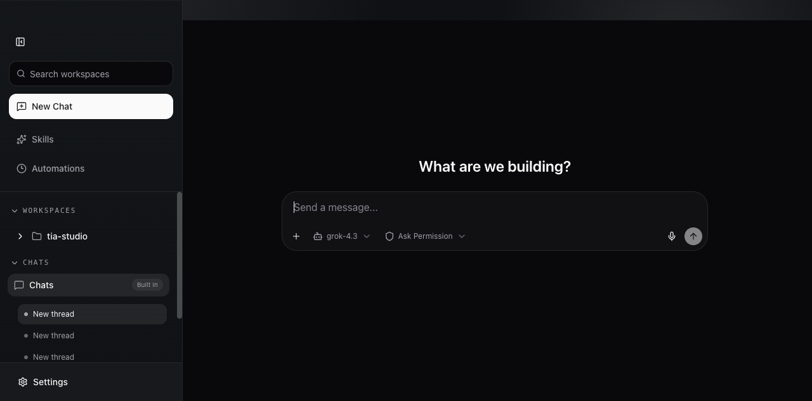
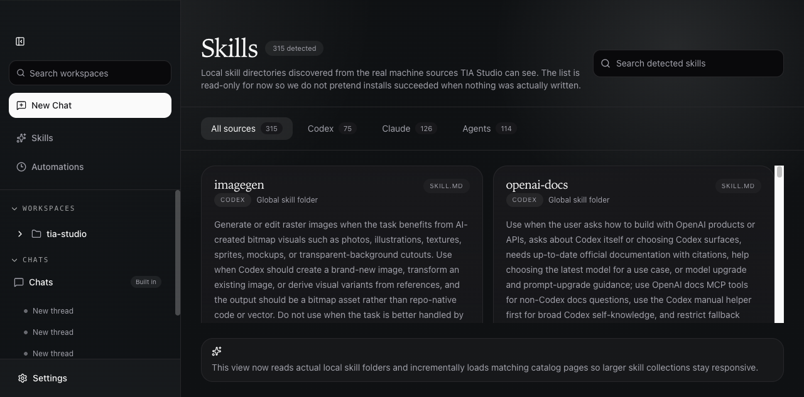

# TIA Studio

[English](./README.md)

TIA Studio 是一款 local-first Electron 工作区，用于让 Pi Coding Agent 在你的本地文件与工具上工作。文件夹工作区、内置 Chats 区域和外部消息 channel 共用一套由应用管理的 Pi runtime。



## 当前可用功能

### Pi 对话

- 文件夹工作区，以及用于临时对话和 channel 对话的内置 Chats 工作区
- 支持搜索与折叠的侧边栏，并提供自动会话标题、置顶和删除
- 流式文本、推理、工具调用、工具结果、权限请求与错误状态
- 每个会话可选择模型，并持久化 **Ask Permission** 或 **Full Access** 模式
- 图片附件，以及按运行环境检测的系统原生语音输入
- Pi 运行期间支持取消、steering 和 follow-up queue
- 本地应用元数据与 Pi session 文件会在应用重启后保留对话

### 连接与配置

- 本地保存的 provider profile，支持自定义 endpoint、模型列表、连接检查、vision 与默认 provider
- 支持 stdio 和 URL transport 的 MCP server 配置
- Discord、Lark、Telegram、WhatsApp、微信与企业微信 channel；远端消息会进入 Chats 中的 Pi 会话
- 语言选择、亮色/暗色/跟随系统主题，以及可调整的外观颜色

### Skills 与 Automations

- 只读 Skills 目录，发现全局 Codex、Claude、Agents 与 workspace skill 文件夹
- 支持搜索、来源筛选，以及适合大型本地目录的增量加载
- 只读 Automations 页面，用于查看发现到的 Codex 定时任务、prompt、project、model、状态与来源文件

目前不能在这些目录页面中安装 skill，也不能创建、编辑、暂停或执行 automation 定义。



## 运行时架构

- **内嵌 Pi SDK** — Electron main 导入固定版本的 `@earendil-works/pi-coding-agent`，并在自身 Node.js host 中创建 session。
- **应用自有 API** — renderer 只与本地 HTTP/SSE 边界通信；Pi SDK 对象和 provider credential 不会进入 renderer。
- **Assistant UI** — 使用官方 assistant-ui thread 渲染空会话、流式输出、工具、审批、附件与错误状态。
- **本地持久化** — SQLite 保存应用 session 元数据与标准化事件；Pi session 文件负责 SDK 的重启恢复。
- **唯一执行路径** — 桌面聊天和 channel 投递共用内嵌 runtime，不存在第二套 agent harness 或外部执行服务。

Pi thread 不会注入 identity、soul、memory、prompt 或 preboot 文件。用户选择的 workspace 会直接交给 Pi；Chats 使用空白的应用管理目录。

## Channels

每个远端会话都会持久映射到 Chats 中的 Pi thread，并以 Standard Access 运行。认证、pairing、群聊提及规则与 channel 命令见 [CHANNEL.md](./CHANNEL.md)。

## 开发

需要 Node.js 20+ 与 pnpm。

```bash
pnpm install
pnpm run dev
```

浏览器标注模式会继续由 Electron main 承担 API 与 Pi host：

```bash
pnpm run dev:annotate
```

端到端验证请使用带保护的启动器：

```bash
pnpm run e2e:guarded:annotate
pnpm run e2e:guarded
```

如果出现重复创建 session、重复 5xx、持续过高 CPU 或超时，保护器会终止整个进程树。

## 验证与构建

```bash
pnpm run lint
pnpm run typecheck
pnpm test
pnpm run build
pnpm run build:mac:arm64
```

迁移决策与当前 runtime 边界见 [PI_MIGRATION.md](./PI_MIGRATION.md)、[TASKS.md](./TASKS.md) 与 [docs/pi-migration/CURRENT_ARCHITECTURE.md](./docs/pi-migration/CURRENT_ARCHITECTURE.md)。

## 技术栈

- Electron 39、React 19、TypeScript 与 Vite
- `@earendil-works/pi-coding-agent`
- assistant-ui 与 Radix UI
- Hono 与 LibSQL/SQLite

## License

MIT
